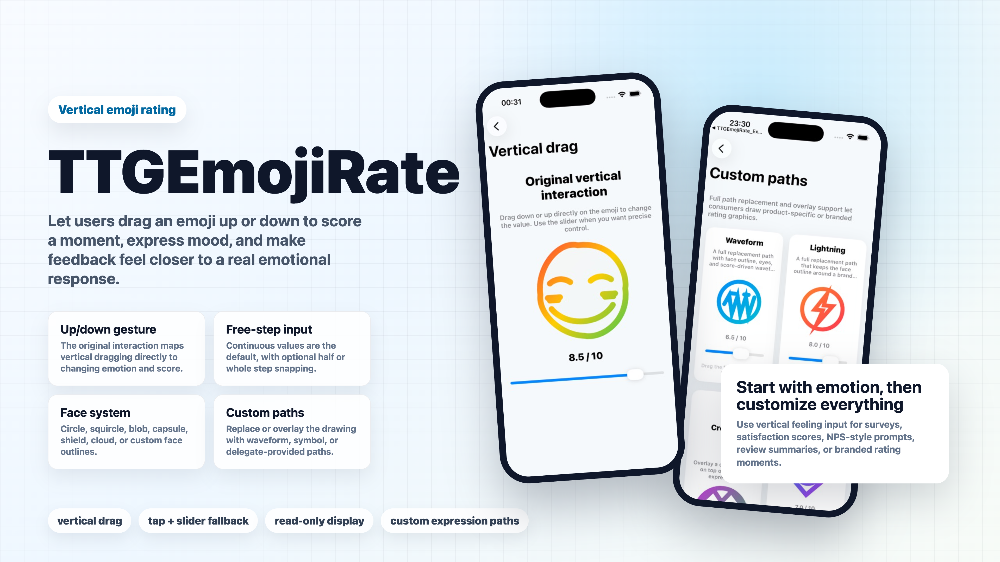
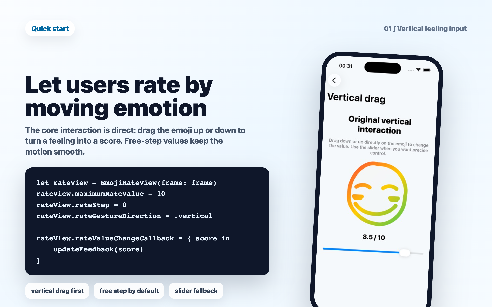
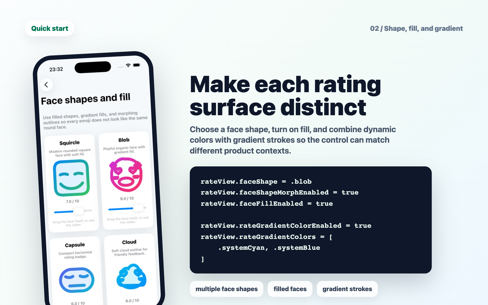
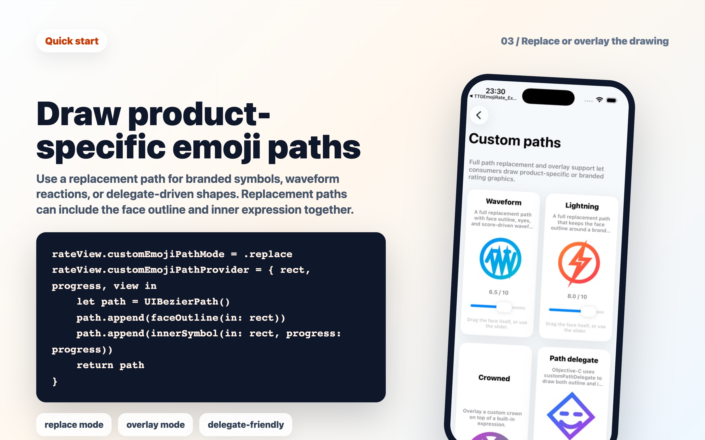

# 😊 TTGEmojiRate

An expressive emoji rating view for iOS.

[](https://travis-ci.org/zekunyan/TTGEmojiRate)
[](http://cocoapods.org/pods/TTGEmojiRate)
[](http://cocoapods.org/pods/TTGEmojiRate)
[](http://cocoapods.org/pods/TTGEmojiRate)
[](https://developer.apple.com/swift/)

TTGEmojiRate turns feedback into a living expression. Its original interaction is vertical drag: users move the emoji up or down to score a moment, express mood, and make ratings feel closer to a real emotional response.



## ✨ Highlights

- 😄 Emotion-first rating UI for reviews, surveys, NPS-style prompts, satisfaction scores, and lightweight mood input.
- 🎚 Free-step values by default, with optional half-step or whole-step snapping when a product needs stricter scoring.
- 🎨 Multiple face shapes, morphing outlines, filled faces, dynamic colors, and gradient strokes/fills.
- ✍️ Custom path replacement or overlay for branded symbols, waveform reactions, badges, or delegate-driven drawings.
- 🔒 Read-only display, tap-to-rate, animated value updates, callbacks, and Interface Builder-friendly properties.
- 🧪 Rebuilt Swift and Objective-C example apps with focused demos and an interactive playground.

## 🚀 Quick Start

Create the control, choose a range, and listen for score changes:



Shape the rating surface with face outlines, fills, and gradients:



Replace or overlay the built-in drawing when the rating UI should feel product-specific:



```swift
import TTGEmojiRate

let rateView = EmojiRateView(frame: CGRect(x: 0, y: 0, width: 220, height: 220))
rateView.minimumRateValue = 0
rateView.maximumRateValue = 10
rateView.rateStep = 0

rateView.rateValueChangeCallback = { score in
    print("Score:", score)
}

view.addSubview(rateView)
```

## 📦 Installation

### CocoaPods

Add TTGEmojiRate to your `Podfile`:

```ruby
pod "TTGEmojiRate"
```

### Carthage

Add TTGEmojiRate to your `Cartfile`:

```text
github "zekunyan/TTGEmojiRate"
```

## 🛠 Customization

### Range and Step

`rateStep = 0` keeps motion continuous. Use `0.5` or `1` when you need snapped survey values.

```swift
rateView.minimumRateValue = 1
rateView.maximumRateValue = 5
rateView.rateStep = 0.5
rateView.setRateValue(4.5, animated: true)
```

### Face Shape, Fill, and Gradient

```swift
rateView.faceShape = TTGEmojiRateFaceShape.blob.rawValue
rateView.faceShapeMorphEnabled = true
rateView.faceFillEnabled = true
rateView.faceFillGradientEnabled = true
rateView.rateGradientColorEnabled = true
rateView.rateGradientColors = [
    .systemCyan,
    .systemBlue,
    .systemPurple
]
```

### Expression Presets

```swift
rateView.setEmojiExpressionPreset(.playful)
rateView.setEmojiEyeStyle(.heart)
rateView.setEmojiMouthStyle(.openSmile)
```

### Custom Paths

```swift
rateView.customEmojiPathMode = TTGEmojiRateCustomPathMode.replace.rawValue
rateView.customEmojiPathProvider = { rect, progress, view in
    let path = UIBezierPath()
    let faceRect = rect.insetBy(dx: 12, dy: 12)
    path.append(UIBezierPath(ovalIn: faceRect))

    let symbol = UIBezierPath()
    let midY = rect.midY + (1 - progress) * 20
    symbol.move(to: CGPoint(x: rect.minX + 54, y: midY))
    symbol.addLine(to: CGPoint(x: rect.midX, y: midY - 18))
    symbol.addLine(to: CGPoint(x: rect.maxX - 54, y: midY))
    path.append(symbol)

    return path
}
```

Use `.overlay` when you want to keep the built-in emoji and draw extra artwork on top.

### Display States

```swift
rateView.isReadOnly = true
rateView.isTapToRateEnabled = false
rateView.setRateColor(from: .systemBlue, to: .systemGreen)
```

## 🧪 Examples

The repository includes both Swift and Objective-C examples. Each example is fully code-driven and includes:

- A playground for live configuration.
- Focused demos for gesture input, face shapes, gradients, custom paths, read-only state, and programmatic updates.
- Slider-backed screens for precise testing alongside direct emoji interaction.

Run `pod install` inside `Example-Swift` or `Example-Objc`, then open the generated workspace.

## ✅ Requirements

- iOS 16.0+
- Xcode 15+
- Swift 5.9+

## 🙌 Credits

Inspired by [Rating Version A - Hoang Nguyen](https://dribbble.com/shots/2211556-Rating-Version-A).

Android version: [PeterSmileRate](https://github.com/SilicorniO/PeterSmileRate) by [SilicorniO](https://github.com/SilicorniO).

Blog: [土土哥的技术Blog - Swift开源项目: TTGEmojiRate的实现](http://tutuge.me/2015/10/25/ttgemojirate-lib/)

## Author

zekunyan, zekunyan@163.com

## License

TTGEmojiRate is available under the MIT license. See the LICENSE file for more info.
